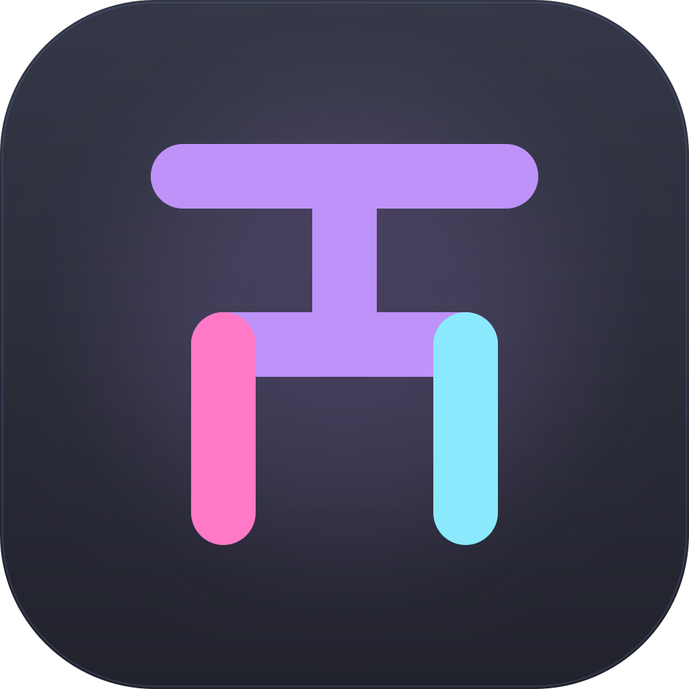

<p align="center"></p>

# terminator-rust

A terminator-style terminal multiplexer built with
[egui](https://github.com/emilk/egui)/eframe and the
[ghostty](https://github.com/ghostty-org/ghostty) VT engine
(`libghostty-vt`, consumed via `libghostty-rs`).

 pure-functional Rust, no classes.

## Features

- Tabs and recursive pane splits (horizontal / vertical), terminator-style
  shortcuts, drag dividers, per-tab zoom.
- Per-pane overrides: custom background color, transparency, manual titles.
- Theme packs: catppuccin-mocha, tokyo-night, dracula, gruvbox-dark,
  terminator-classic; ANSI 256-color cube support.
- Invisible remote sessions: `ssh -tt` + auto-bootstrapped `zellij`
  (`~/.cache/zt`) with keybinds cleared and frames off, so the remote
  multiplexer never fights the local one. Reconnect on drop; graceful
  degrade to plain ssh (exit 42 marker) when zellij is missing.
- Layout and pane state persisted to `~/.terminator-rust/state.json`;
  remote hosts registry at `~/.terminator-rust/sessions.json` (a legacy
  `~/.config/terminator-rust/` file is migrated forward on first run);
- App icon / logo: the dracula-palette "split T" in `assets/logo`,
  deterministically regenerated by `scripts/bin/gen-logo.py` and set as
  the window icon of every OS window.

## Fonts / Unicode

The binary embeds a Noto Sans SC subset (OFL, `assets/fonts/OFL.txt`) as
the last entry of every font fallback chain, so Han, kana, bopomofo,
fullwidth forms, roman numerals, circled digits AND Hangul syllables
(AC00-D7AF) render with zero system-font dependency, so Linux and macOS
output is identical by construction. Override with
`TERMINATOR_CJK_FONT=path[:face_index]` to swap in any system font, e.g.
a full `NotoSansCJK.ttc` face for Traditional/Korean-preferred glyph
variants or Ext-B coverage. The override is parse-validated at startup
and falls back to the embedded font with a warning if the file is
unreadable or not a valid font.

## Layout

| crate        | role                                                    |
| ------------ | ------------------------------------------------------- |
| `layout-tree`| tab/pane tree, splits, focus, divider geometry          |
| `vt-pane`    | PTY + ghostty VT session (fork/exec, resize, key encode)|
| `theme`      | palettes, xterm 256 color, background blending          |
| `remote`     | ssh/zellij bootstrap, registry, reconnect plans         |
| `app`        | egui front-end (rendering, input, tabs, headers, UI)    |

`third_party/libghostty-vt/` holds a prebuilt static ghostty VT library
(gitignored; see `third_party/README.md`).

`assets/logo/` holds the generated logo set (`terminator-rust.svg`,
`icon-{16..1024}.png`, `.ico`, `.icns`), reproduced byte-for-byte by
`scripts/bin/gen-logo.py` (`--check` is the CI drift gate).

## Build

Requirements: Rust stable, a C compiler, `pkg-config`. The vendored
ghostty static lib is rebuilt with zig automatically when missing:

```sh
cargo build --workspace
cargo test --workspace
# optional e2e (needs local sshd + zellij):
cargo test -p remote --test zellij_e2e -- --ignored
```

Run: `cargo run -p app` (binary `terminator-rust`).

## Shortcuts

| keys                | action                       |
| ------------------- | ---------------------------- |
| Ctrl+Shift+T        | new tab                      |
| Ctrl+Shift+W        | close pane                   |
| Ctrl+Shift+O / E    | split horizontal / vertical  |
| Ctrl+Tab / +Shift   | cycle panes                  |
| Ctrl+Shift+Arrows   | move focus                   |
| Ctrl+PageUp / Down  | prev / next tab              |
| Ctrl+Shift+F        | zoom focused pane            |
| Ctrl+Shift+R        | respawn / reconnect pane     |
| Ctrl+Shift+V        | paste into pane              |

Tab bar: middle-click closes, double-click renames. Pane header:
double-click renames, swatch button sets color, moon button sets
transparency, right-click for context menu.

## Non-goals (v1)

Scrollback scrollbar UI, kitty graphics protocol, window transparency /
blur, Windows support.

## macOS notes

Supported natively (aarch64-apple-darwin); CI runs fmt/clippy/tests on
macos-15 (`build-test-macos` job). Platform specifics:

- PTY: `posix_openpt`/`fork`/`execve` everywhere; the slave name comes
  from `ptsname_r` on Linux and `TIOCPTYGNAME` on macOS, and child
  locales default to `en_US.UTF-8` (macOS has no `C.UTF-8`).
- Build: `brew install pkg-config`, `pip3 install ziglang==0.16.0`, then
  `scripts/fetch-vendor.sh` (the `scripts/bin/zig` wrapper falls back to
  `python3 -m ziglang`). Vendored ghostty artifacts are per-OS: re-run
  fetch-vendor on the Mac, never copy `third_party/` from Linux.
- `ctl oc` process discovery uses libproc (`proc_pidinfo`/`proc_pidfdinfo`)
  instead of `/proc`; same semantics, incl. the multi-store refusal.
- Fonts, cell metrics (device-pixel snapping, wide-cell = 2x narrow),
  theme, IPC socket, state.json paths and the egui UI are identical on
  both platforms by construction.
- X11-only bits are cfg-gated: pointer polling (XQueryPointer) falls
  back to event-driven edge resize; e2e scripts (Xvfb/xdotool) stay
  Linux-only.
