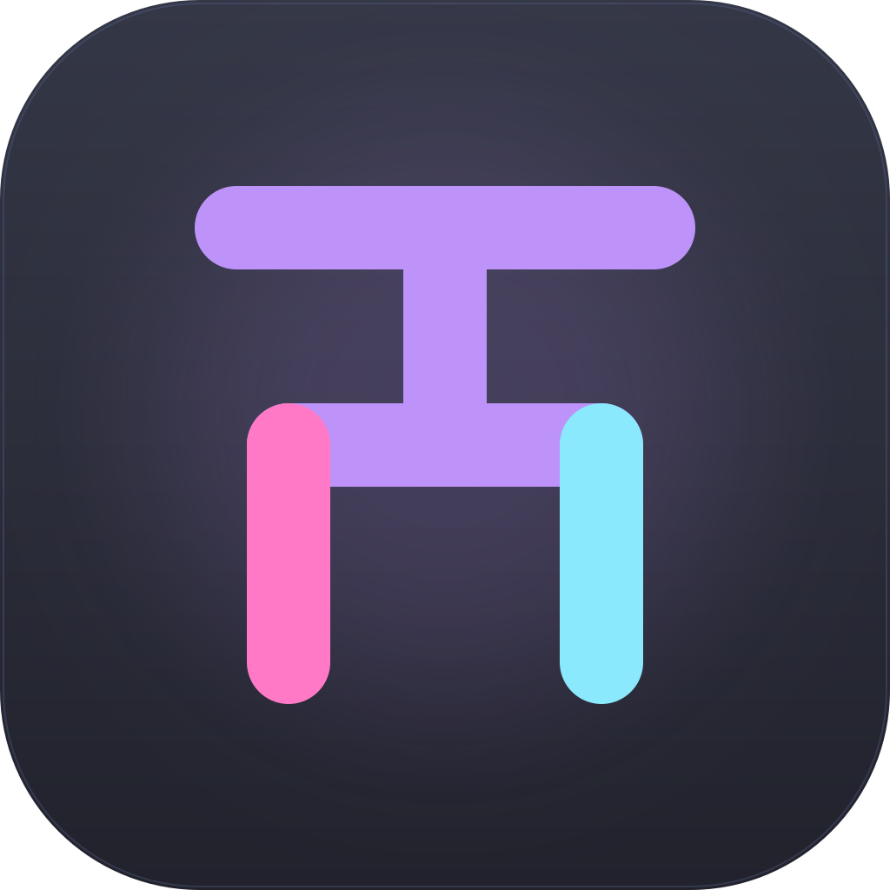

<p align="center"></p>

# terminator-rust

A terminator-style terminal multiplexer built with
[egui](https://github.com/emilk/egui)/eframe and the
[ghostty](https://github.com/ghostty-org/ghostty) VT engine
(`libghostty-vt`, consumed via `libghostty-rs`).

 pure-functional Rust, no classes.

## Features

- Tabs and recursive pane splits (horizontal / vertical), terminator-style
  shortcuts, drag dividers, per-tab zoom.
- Per-pane overrides: custom background color, transparency, manual titles.
- Theme packs: catppuccin-mocha, tokyo-night, dracula, gruvbox-dark,
  terminator-classic; ANSI 256-color cube support.
- Invisible remote sessions: `ssh -tt` uses `terminator-session` when it is
  installed on the remote host. Its detached daemon owns the shell PTY while
  SSH is down, and reconnecting by the saved session name reattaches it.
  Without the keeper, the pane falls back to plain SSH.
- Layout and pane state persisted to `~/.terminator-rust/state.json`;
  remote hosts registry at `~/.terminator-rust/sessions.json` (a legacy
  `~/.config/terminator-rust/` file is migrated forward on first run);
- App icon / logo: the dracula-palette "split T" in `assets/logo`,
  deterministically regenerated by `scripts/bin/gen-logo.py` and set as
  the window icon of every OS window.

## Tab notices

Run `terminator-ctl notice` inside a local pane to mark its tab with a blue
dot while that tab is in the background. Repeated notices keep one dot;
opening the tab clears it. The terminal passes its socket, pane ID, and
sibling `terminator-ctl` path to local child processes, so agent hooks can
run `"${TERMINATOR_CTL:-terminator-ctl}" notice` without looking up a pane.
From outside the pane, use `terminator-ctl notice <pane>` with a pane ID or
unique manual pane title.

## Fonts / Unicode

The binary embeds a Noto Sans SC subset (OFL, `assets/fonts/OFL.txt`) as
the last entry of every font fallback chain, so Han, kana, bopomofo,
fullwidth forms, roman numerals, circled digits AND Hangul syllables
(AC00-D7AF) render with zero system-font dependency, so Linux and macOS
output is identical by construction. Override with
`TERMINATOR_CJK_FONT=path[:face_index]` to swap in any system font, e.g.
a full `NotoSansCJK.ttc` face for Traditional/Korean-preferred glyph
variants or Ext-B coverage. The override is parse-validated at startup
and falls back to the embedded font with a warning if the file is
unreadable or not a valid font.

## Layout

| crate        | role                                                    |
| ------------ | ------------------------------------------------------- |
| `layout-tree`| tab/pane tree, splits, focus, divider geometry          |
| `vt-pane`    | PTY + ghostty VT session (fork/exec, resize, key encode)|
| `theme`      | palettes, xterm 256 color, background blending          |
| `remote`     | ssh/keeper bootstrap, registry, reconnect plans         |
| `terminator-session` | remote PTY keeper, attach and list CLI       |
| `app`        | egui front-end (rendering, input, tabs, headers, UI)    |

`third_party/libghostty-vt/` holds a prebuilt static ghostty VT library
(gitignored; see `third_party/README.md`).

## Remote session keeper

Install the release package's `bin/terminator-session` on a remote Linux or
macOS host in a directory on that account's noninteractive SSH `PATH` (for
example `~/.local/bin`). New remote panes then choose it automatically.
Existing external session processes are not modified or stopped by installing
the keeper. New app connections use `terminator-session` by name; they do not
attach to sessions owned by another manager.

`terminator-session list` shows one line per live keeper, following the
compact `cl`/`ol` listing style:

```text
SESSION                  STATE      CWD                                  TITLE
build                    detached   /srv/project                         release build
ops                      attached   /srv/service                         production diagnostics
```

Use `terminator-session attach NAME --title "purpose"` for a direct shell
session. The GUI supplies the saved remote label as its title. A session's
name selects its private socket under `~/.terminator-rust/sessions`; its
title and creation directory describe its purpose. The keeper replays its
last 4 MiB of PTY output when a client reconnects. The shell process stays
alive across SSH disconnects, and multiple clients can attach at once.
Once the shell exits, its session ends.

`assets/logo/` holds the generated logo set (`terminator-rust.svg`,
`icon-{16..1024}.png`, `.ico`, `.icns`), reproduced byte-for-byte by
`scripts/bin/gen-logo.py` (`--check` is the CI drift gate).

## Build

Requirements: Rust stable, a C compiler, `pkg-config`. The vendored
ghostty static lib is rebuilt with zig automatically when missing:

```sh
cargo build --workspace
cargo test --workspace
# isolated keeper reconnect test (uses a private HOME):
cargo test -p terminator-session --test reconnect
```

Run: `cargo run -p app` (binary `terminator-rust`).

## Shortcuts

| keys                | action                       |
| ------------------- | ---------------------------- |
| Ctrl+Shift+T        | new tab                      |
| Ctrl+Shift+W        | close pane                   |
| Ctrl+Shift+O / E    | split horizontal / vertical  |
| Ctrl+Tab / +Shift   | cycle panes                  |
| Ctrl+Shift+Arrows   | move focus                   |
| Ctrl+PageUp / Down  | prev / next tab              |
| Ctrl+Shift+F        | zoom focused pane            |
| Ctrl+Shift+R        | respawn / reconnect pane     |
| Ctrl+Shift+V        | paste into pane              |

Tab bar: middle-click closes, double-click renames. Pane header:
double-click renames, swatch button sets color, moon button sets
transparency, right-click for context menu.

## Non-goals (v1)

Scrollback scrollbar UI, kitty graphics protocol, window transparency /
blur, Windows support.

## macOS notes

Supported natively (aarch64-apple-darwin); CI runs fmt/clippy/tests on
macos-15 (`build-test-macos` job). Platform specifics:

- PTY: `posix_openpt`/`fork`/`execve` everywhere; the slave name comes
  from `ptsname_r` on Linux and `TIOCPTYGNAME` on macOS, and child
  locales default to `en_US.UTF-8` (macOS has no `C.UTF-8`).
- Build: `brew install pkg-config`, `pip3 install ziglang==0.16.0`, then
  `scripts/fetch-vendor.sh` (the `scripts/bin/zig` wrapper falls back to
  `python3 -m ziglang`). Vendored ghostty artifacts are per-OS: re-run
  fetch-vendor on the Mac, never copy `third_party/` from Linux.
- `ctl oc` process discovery uses libproc (`proc_pidinfo`/`proc_pidfdinfo`)
  instead of `/proc`; same semantics, incl. the multi-store refusal.
- Fonts, cell metrics (device-pixel snapping, wide-cell = 2x narrow),
  theme, IPC socket, state.json paths and the egui UI are identical on
  both platforms by construction.
- X11-only bits are cfg-gated: pointer polling (XQueryPointer) falls
  back to event-driven edge resize; e2e scripts (Xvfb/xdotool) stay
  Linux-only.
